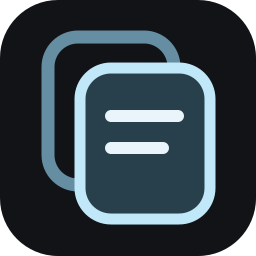

<div align="center">
  
  <h1>LClip</h1>
  <p><strong>Your clipboard, expressions, and reactions — one shortcut away.</strong></p>
  <p>A private, system-integrated clipboard history and expression picker for Linux.</p>
  <p>
    <a href="https://github.com/Sanal-Sivakumar/Lclip/actions/workflows/ci.yml"></a>
    
    
    <a href="LICENSE"></a>
  </p>
  <p>
    <code>Super</code> + <code>.</code>
  </p>
</div>

---

LClip stays ready after graphical login. Press `Super + .` from any application to open a polished, dark glass picker containing the last 10 copied text items, emoji, kaomoji, GIFs, and useful symbols.

> [!IMPORTANT]
> LClip never replaces normal `Ctrl+C` or `Ctrl+V`. It registers only `Super + .`; it is not a keylogger and does not receive unrelated keystrokes.

**[Install LClip](#install-on-linux)** · **[Read the technical guide](technical_details.md)** · **[Open troubleshooting](troubleshooting.md)**

## Contents

- [Features](#features)
- [How LClip behaves](#how-lclip-behaves)
- [Linux support](#linux-support)
- [Install on Linux](#install-on-linux)
- [Using LClip](#using-lclip)
- [GIF search](#gif-search)
- [Development](#development)
- [Architecture](#architecture)
- [Privacy and security](#privacy-and-security)
- [GitHub and releases](#github-and-releases)
- [Uninstall](#uninstall)
- [Further documentation](#further-documentation)

## Features

| | Capability | What it gives you |
| --- | --- | --- |
| **▣** | **Clipboard history** | The latest 10 non-empty copied text items, deduplicated and stored locally |
| **☺** | **Emoji picker** | Searchable emoji that work in any text-capable application |
| **ツ** | **Kaomoji** | Expressive text faces that need no special image support |
| **GIF** | **GIPHY search** | Optional reaction search with a user-supplied API key |
| **Ω** | **Special characters** | Arrows, currency, mathematics, punctuation, and technical symbols |
| **⌨** | **Keyboard-first control** | Search, arrow navigation, `Enter` to paste, and `Esc` to close |
| **◉** | **Desktop integration** | Login autostart, tray controls, global shortcut, and automatic-paste bridge |
| **◇** | **Glass interface** | Compact, dark, translucent UI designed to stay out of the workflow |

LClip can pause capture, clear history, and report shortcut or paste limitations honestly instead of silently claiming success.

## How LClip behaves

### Clipboard history

LClip checks the standard text clipboard every 350 milliseconds while capture is enabled. When the clipboard contains new, non-empty text, LClip adds it to the front of the local history. Each entry is limited to 50,000 characters, duplicate text is stored once, and only the newest 10 entries remain.

Images and files copied through a file manager are not added to the history in the current version. GIF selection is handled separately.

### Global shortcut

At startup, LClip asks Electron and the Linux desktop to register `Super + .` as a global shortcut. A global shortcut is a key combination that the desktop can deliver even while another application has focus. LClip does not continuously inspect every key that is pressed.

- On X11, the chord is normally registered directly.
- On Wayland, the request can be handled through the desktop's Global Shortcuts portal. Depending on the desktop and its security policy, a one-time approval dialog may appear.
- If the chord is already owned by the desktop or another application, LClip shows the conflict in Settings and does not substitute another shortcut.

### Selecting and pasting an item

When an item is selected, LClip:

1. Writes the selected value to the normal system clipboard.
2. Hides its picker window.
3. Waits briefly so the previous application can regain focus.
4. Uses the best available input bridge to send the normal `Ctrl+V` paste action.

LClip prefers `ydotool`, then `wtype` on Wayland, then `xdotool`. If Linux blocks automatic input or no bridge is installed, the item is still copied safely and LClip displays a notification asking the user to press `Ctrl+V` manually.

## Linux support

LClip is designed for GNOME and KDE Plasma on Wayland, with an X11 fallback. It also installs an XDG autostart entry for several related desktop environments. Exact global-shortcut and automatic-paste behavior depends on the distribution, desktop, compositor, portal version, and security settings.

This repository is developed and packaged from macOS as well as Linux, but the operating-system integration must be verified on a real Linux graphical session. A successful build on macOS does not prove that a particular GNOME or KDE configuration will permit synthetic paste.

Recommended environment:

- 64-bit Linux on x86-64 or ARM64
- GNOME or KDE Plasma
- Wayland or X11 graphical session
- Node.js 20 or newer and npm for building from source
- `sudo` for the system-wide installation step

## Install on Linux

### Before you begin

You need:

- a 64-bit Linux laptop using x86-64 or ARM64;
- Node.js 20 or newer with npm;
- an active graphical desktop session;
- `sudo` permission for the system installation.

Confirm the build tools:

```bash
node --version
npm --version
```

### Guided system installation

Clone the repository and run the included installer:

```bash
git clone --depth 1 https://github.com/Sanal-Sivakumar/Lclip.git
cd Lclip
chmod +x scripts/install-system.sh scripts/uninstall-system.sh
./scripts/install-system.sh
```

The installer performs the complete setup:

1. Confirms that it is running on Linux.
2. Installs the exact JavaScript dependencies from `package-lock.json`.
3. Runs syntax checks and all automated tests.
4. Detects whether the laptop uses x86-64 or ARM64.
5. Builds the matching Electron application bundle.
6. Installs the application under `/opt/lclip`.
7. Creates the `lclip` terminal command and application-menu entry.
8. Adds graphical-login autostart for supported desktop environments.
9. Attempts to install an automatic-paste bridge using `apt`, `dnf`, `pacman`, or `zypper`.

When installation finishes, start LClip immediately:

```bash
lclip --show
```

Press `Super + .` to confirm that the global picker opens. LClip will start in the background automatically after the next graphical login.

> [!NOTE]
> Wayland may show a one-time desktop approval for the global shortcut. That permission belongs to GNOME/KDE and is not requested every time the picker opens.

### Install without an input bridge

If you want to configure `ydotool`, `wtype`, or `xdotool` yourself:

```bash
./scripts/install-system.sh --skip-input-bridge
```

LClip will still copy selected values to the clipboard. Until a supported bridge is available, press normal `Ctrl+V` to paste the selected value.

### Installed locations

| Location | Purpose |
| --- | --- |
| `/opt/lclip/` | Packaged Electron application |
| `/usr/local/bin/lclip` | Command available in the terminal |
| `/usr/share/applications/io.lclip.LClip.desktop` | Application-menu entry |
| `/usr/share/icons/hicolor/scalable/apps/io.lclip.LClip.svg` | System application icon |
| `/etc/xdg/autostart/io.lclip.LClip.desktop` | Starts LClip after graphical login |

### Why LClip is not a root boot daemon

The active clipboard, focused window, display server, and global shortcuts belong to the logged-in graphical session. A root service started before login normally has no correct display session to control. It would also be a security mistake to place copied passwords and personal text inside a privileged process.

LClip is therefore **installed system-wide** under `/opt/lclip`, but **runs as the logged-in user** through standard XDG autostart. This is the normal OS-integrated design for a desktop utility.

## Using LClip

1. Copy text normally with `Ctrl+C` or an application's Copy command.
2. Press `Super + .` from any application.
3. Choose History, Emoji, Kaomoji, GIFs, or Symbols.
4. Search by typing, move with the arrow keys, and press `Enter`; or click an item.
5. Press `Esc` or click outside the picker to close it without selecting anything.

Useful controls:

- **Pause capture** stops adding new clipboard text without deleting existing history.
- **Clear** permanently removes the currently stored history entries.
- **Start after login** controls the per-user override for system autostart.
- The tray icon can open LClip, pause or resume capture, and quit the process.

## GIF search

GIF search is the only network-backed feature. Create a GIPHY developer key, open LClip Settings, enter the key, choose a content rating, and save.

The request is made by Electron's main process. The renderer is not allowed to make arbitrary network connections. Results are limited to HTTPS URLs belonging to GIPHY, downloads time out after 12 seconds, and a selected GIF is rejected if its downloaded data exceeds 15 MB.

Applications treat GIF clipboard content differently. LClip places an image, an HTML image reference, and the GIPHY URL on the clipboard so the target can choose a supported format. Plain-text targets may paste only the URL.

## Development

Install dependencies and open the development build:

```bash
npm install
npm run dev
```

Run syntax checks and the automated tests:

```bash
npm run verify
```

Build an unpacked Linux application:

```bash
npm run pack:linux
```

Build AppImage, Debian, and RPM artifacts:

```bash
npm run dist:linux
```

The desktop integrations do not run fully on macOS. On macOS, the renderer can be reviewed and the store and bridge-detection tests can run, but the final shortcut, autostart, clipboard, tray, and paste behavior should be tested on Linux.

## Architecture

LClip is an Electron application split into security boundaries:

- `src/main/main.mjs` owns the desktop window, clipboard monitor, global shortcut, tray, state, GIPHY requests, and system integration.
- `src/main/store.mjs` validates, limits, deduplicates, and persists local state.
- `src/main/paste-bridge.mjs` detects and invokes a supported Linux input tool.
- `src/preload/preload.cjs` exposes a small, named API to the UI through Electron's context bridge.
- `src/renderer/` contains the HTML, CSS, and browser-side interaction code.
- `scripts/` contains the Linux system installer and uninstaller.
- `tests/` verifies history rules and paste-bridge selection.

See [technical_details.md](technical_details.md) for a beginner-friendly explanation of Electron, GNOME, KDE, X11, Wayland, portals, IPC, autostart, packaging, and every major runtime flow.

## Privacy and security

- History is local and capped at 10 text entries.
- State is written with user-only file permissions (`0600`) inside a user-only directory (`0700`).
- LClip registers one global chord and does not record arbitrary keyboard input.
- The UI has Node.js integration disabled, context isolation enabled, and Electron sandboxing enabled.
- A restrictive Content Security Policy blocks arbitrary scripts, objects, navigation, and renderer network connections.
- External links are limited to official GIPHY pages and open in the system browser.
- GIPHY is optional; history, emoji, kaomoji, and symbols work offline.
- The uninstaller preserves user data to prevent unexpected data loss.

Clipboard managers are inherently sensitive because copied text can contain secrets. Pause capture before copying confidential material, clear history when necessary, and protect the Linux user account and disk.

## GitHub and releases

The CI workflow verifies pushes and pull requests and uploads an unpacked x86-64 Linux build. The release workflow builds AppImage and Debian packages when a version tag is pushed.

```bash
git tag v1.0.0
git push origin main --tags
```

Review the generated release on GitHub before distributing it. RPM packaging is available through the local `npm run dist:linux` command but is not currently included in the release workflow.

## Uninstall

From a repository checkout, run:

```bash
./scripts/uninstall-system.sh
```

The uninstaller removes the application, launcher, menu entry, icon, system autostart file, and the current user's autostart override. It deliberately leaves the current user's LClip history and settings in place. The script prints the remaining location so it can be deleted manually if desired.

## Further documentation

| Document | Start here when you want to… |
| --- | --- |
| **[Technical Details](technical_details.md)** | Understand GNOME, KDE, X11, Wayland, Xwayland, portals, Electron, IPC, security, packaging, and LClip's complete data flow from first principles |
| **[Troubleshooting](troubleshooting.md)** | Diagnose installation, autostart, shortcut, clipboard, automatic-paste, GIPHY, graphics, or development failures |
| **[Product](PRODUCT.md)** | Read the product purpose, intended users, principles, and accessibility goals |
| **[Design](DESIGN.md)** | Explore the visual system, interface decisions, colors, spacing, and interaction direction |

> New to Linux desktop terminology? Begin with **[LClip Technical Details](technical_details.md)**. If something is not working, go directly to **[LClip Troubleshooting](troubleshooting.md)**.

## License

LClip is available under the [MIT License](LICENSE).
