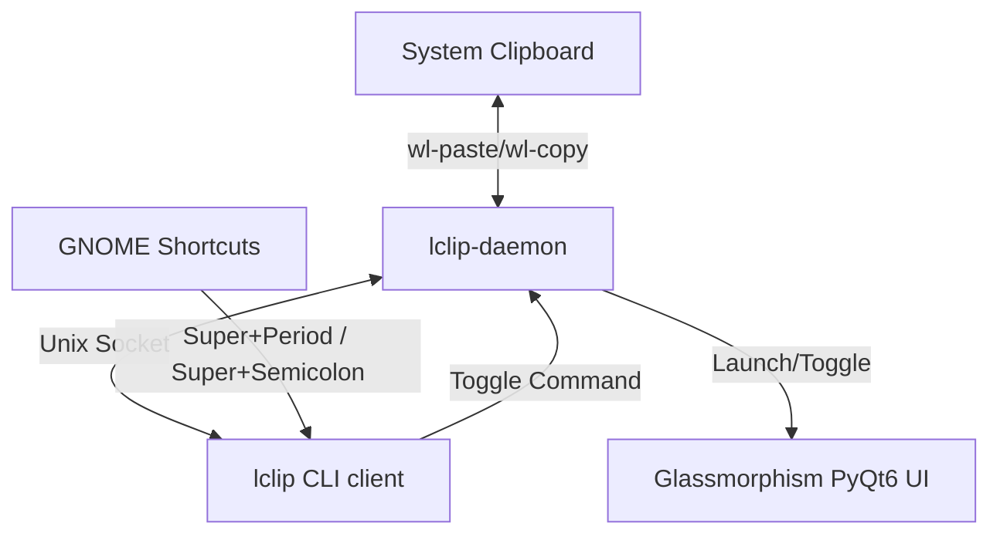

# Implementation Plan - Lclip Clipboard Manager & Symbol Picker

Lclip is a keyboard-navigable clipboard manager and emoji/kaomoji/symbol picker for Linux. It features a modern glassmorphism design, works under Wayland and X11, runs as a background daemon, and replicates the native Windows emoji panel feel (`Super+.` and `Super+;`).

## User Review Required

> [!IMPORTANT]
> - **Global Shortcuts:** To register the global shortcuts (`Super+.` and `Super+;`), Lclip will disable the default GNOME IBus emoji picker shortcuts (`org.freedesktop.ibus.panel.emoji hotkey`) and map them to our toggle client.
> - **System Packages:** Lclip requires `wl-clipboard` (for Wayland clipboard tracking) or `xclip` (for X11), and optionally `xdotool` (for auto-pasting on X11). The setup script will attempt to install these or prompt you to install them.
> - **Wayland Paste Limitation:** Wayland's security model blocks applications from injecting keyboard input into other windows. Under Wayland, Lclip will copy your selected items to the clipboard and close immediately, letting you paste via `Ctrl+V`. On X11, auto-pasting will be simulated automatically.

## Proposed Architecture

Lclip will be structured into a modular Python application:

1. **`lclip-daemon`**: Run in the background. Watches the clipboard (both text and images) using `wl-paste` (Wayland) or native APIs (X11). Saves history in `~/.cache/lclip/` (with a JSON index and cached image files). Listens on a Unix socket (`~/.cache/lclip/lclip.sock`) for show/hide commands.
2. **`lclip-ui`**: A borderless, transparent PyQt6 popup window. Designed with:
   - **Glassmorphism Theme**: Semi-transparent dark background, rounded corners, sleek light borders, dynamic hover effects, and modern fonts (e.g., Inter/Roboto if available).
   - **Keyboard Navigation**: Arrow keys to navigate grids/lists, `Enter` to select, `Esc` to close, `Tab`/`Shift+Tab` to switch tabs.
   - **Multi-select Mode**: Press `Space` or `Ctrl+Click` to select multiple items from clipboard history and copy/paste them combined.
   - **Tabs**:
     - *Clipboard History*: Text snippets, image thumbnails, pins, deletion, multi-select.
     - *Emojis*: Searchable emoji grid categorized by type.
     - *Kaomojis*: Japanese text faces categorized by emotion.
     - *Special Characters*: Currency, math symbols, punctuation.
3. **`lclip` client**: A fast helper CLI to send the toggle command to the daemon.

## Proposed Changes

We will build the application in `/home/sanal-sivakumar/Documents/Lclip`.

### [NEW] [lclip/main.py](file:///home/sanal-sivakumar/Documents/Lclip/lclip/main.py)
Entrypoint for the application. Parses command line arguments (`--daemon`, `--toggle`, `--clear`, etc.) and routes them to the daemon or client.

### [NEW] [lclip/daemon.py](file:///home/sanal-sivakumar/Documents/Lclip/lclip/daemon.py)
Implementation of the background daemon:
- Periodically checks clipboard changes via `wl-paste` or python library.
- Manages history storage (reading/writing to JSON, saving copied images as files).
- Serves the Unix domain socket for client-daemon communication.
- Manages the UI process or window instance.

### [NEW] [lclip/ui.py](file:///home/sanal-sivakumar/Documents/Lclip/lclip/ui.py)
PyQt6 implementation of the visual panel:
- Frameless window with transparent background (`WA_TranslucentBackground`).
- Stylesheet implementing glassmorphism CSS.
- Top navigation bar matching Windows 11 style.
- Search filter field.
- Custom widget list for clipboard history cards (supporting image thumbnails and pin buttons).
- Grid layout for emojis, kaomojis, and symbols.
- Key event filters to enable complete mouse-free keyboard navigation.

### [NEW] [lclip/data.py](file:///home/sanal-sivakumar/Documents/Lclip/lclip/data.py)
Stores pre-defined collections of:
- Emojis (categorized).
- Kaomojis (e.g. `(*^.^*)`, `(¯_¯)`, `(╯°□°）╯︵ ┻━┻`).
- Special characters and symbols.

### [NEW] [setup.sh](file:///home/sanal-sivakumar/Documents/Lclip/setup.sh)
Automation script to:
1. Create python virtualenv and install dependencies (`PyQt6`).
2. Register the helper script in user binary path (`~/.local/bin/lclip`).
3. Setup user autostart entry for the daemon.
4. Disable default GNOME IBus emoji keybindings.
5. Create GNOME custom shortcuts for `Super+.` and `Super+;`.

## Verification Plan

### Manual Verification
1. Run `setup.sh` to install dependencies and configure the GNOME shortcuts.
2. Verify that pressing `Super+.` or `Super+;` toggles the glassmorphic Lclip window.
3. Test clipboard history by copying some text and an image (e.g. taking a screenshot) and verify it appears in Lclip.
4. Verify keyboard-only navigation: focus search bar, press Arrow Down, navigate items, press Enter to copy and paste.
5. Test emoji, kaomoji, and special character insertion.
6. Verify pinning and clearing all history items.
